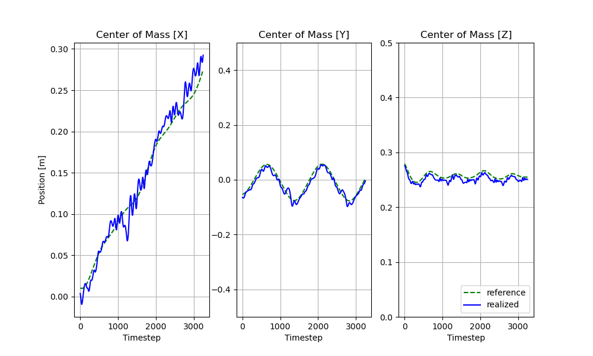
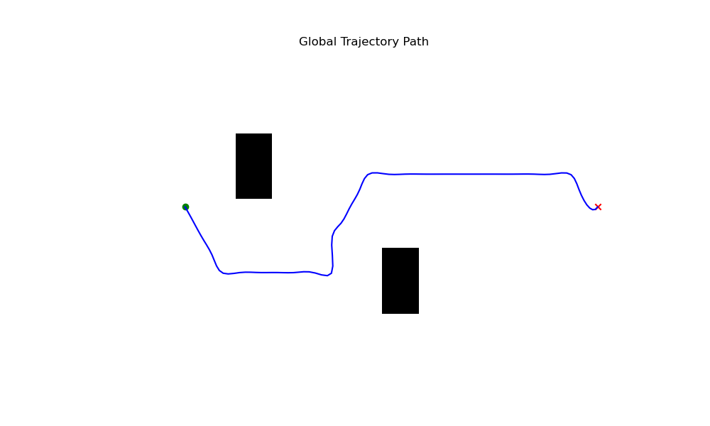

# Quadruped Trajectory Optimization Stack
[Alexy Skoutnev](https://alexyskoutnev.github.io/alexyskoutnev-github.io/index.html), [Andrew Cinfal](https://github.com/cinaral), [Praful Sigdel](https://praful22.github.io/), [Forrest Laine](https://github.com/forrestlaine)

[Project](https://alexyskoutnev.github.io/Quadruped-Trajectory-Optimization-Stack/) | [arXiv](https://arxiv.org/abs/2309.09058)


## Abstract

We introduce a new open-source framework, Quadruped Trajectory Optimization Stack (QTOS), which integrates a global planner, local planner, simulator, controller, and robot interface into a single package. QTOS serves as a full-stack interface, simplifying continuous motion planning on an open-source quadruped platform by bridging the gap between middleware and gait planning. It empowers users to effortlessly translate high-level navigation objectives into low-level robot commands. Furthermore, QTOS enhances the stability and adaptability of long-distance gait planning across challenging terrain.

If you find our work useful in your research or work, please consider [citing](#citing).

## Dependencies

- Python 3.10 (recommended)
- [PyBullet](https://github.com/bulletphysics/bullet3/)
- [Towr](https://github.com/ethz-adrl/towr)
- [Docker](https://www.docker.com/)

## Environment Setup
To help keep all the packages together in one enviroment, please create conda an enviroment.

```console
conda create -n QTOS python=3.10
conda activate QTOS
pip3 install -r requirements.txt
pip3 install -e .
```
## Installing Docker [Ubuntu]
```console
sudo apt-get update
sudo apt-get install ca-certificates curl gnupg
sudo install -m 0755 -d /etc/apt/keyrings
curl -fsSL https://download.docker.com/linux/ubuntu/gpg | sudo gpg --dearmor -o /etc/apt/keyrings/docker.gpg
sudo chmod a+r /etc/apt/keyrings/docker.gpg
echo \
  "deb [arch="$(dpkg --print-architecture)" signed-by=/etc/apt/keyrings/docker.gpg] https://download.docker.com/linux/ubuntu \
  "$(. /etc/os-release && echo "$VERSION_CODENAME")" stable" | \
  sudo tee /etc/apt/sources.list.d/docker.list > /dev/null
sudo apt-get update
sudo apt-get install docker-ce docker-ce-cli containerd.io docker-buildx-plugin docker-compose-plugin
sudo docker run hello-world
```
## Installing Docker [macOS]
```console
sudo hdiutil attach Docker.dmg
sudo /Volumes/Docker/Docker.app/Contents/MacOS/install
sudo hdiutil detach /Volumes/Docker
```

## Docker Installation
```console
DOCKER_BUILDKIT=1 docker build --no-cache -t towr -f Dockerfile .
docker run -d towr
```
Now you should have a Docker image named 'towr,' which will be used in the main.py script within the continuous planning loop. To check that the container was built correctly, use the following command (it should output that the container is an ancestor of the 'towr' image).
```console
docker ps -f ancestor=towr
```
To build a 'towr' environment with a GUI, you would need to create another image named 'Dockerfile_GUI.' However, this image is slow and should only be used for debugging the 'towr' source code and binaries.
```console
DOCKER_BUILDKIT=1 docker build --no-cache -t towr-gui -f Dockerfile_GUI .
docker run -p 6080:80 -v /dev/shm:/dev/shm towr-gui
```
Now open a web browser and type in
```
http://localhost:6080/
```
To launch a visual towr interface in the Towr Docker GUI, use the commands
```console
cd ~/catkin_ws
source /opt/ros/melodic/setup.sh
/opt/ros/melodic/setup.sh >> ~/.bashrc
source ~/.bashrc
catkin_make_isolated -DCMAKE_BUILD_TYPE=Release -j4
source devel_isolated/setup.sh
roslaunch towr_ros towr_ros.launch
```

# Usage

## Running Demos
The demos presented below showcase the features provided by QTOS. To run an example trajectory and test if everything is installed correctly, execute the following command:
```console
cd ~/SOLO12_SIM_CONTROL
python3 scripts/main.py
```
To investigate the motion planning capabilities, you can run the following three navigation tasks:
- Walking (exp_1)
- Avoidance (exp_3)
- Climbing (exp_5)

These tasks can be executed using the following commands:
```console
python3 scripts/main.py -exp exp_1
python3 scripts/main.py -exp exp_3
python3 scripts/main.py -exp exp_5
```

## Tracking Data
QTOS tracks the CoM, Endeffector, and controller errors at each timestep of the simulator, and it plots the resulting data in the folder `/data/tracking/*`. Please note that you can view the tracking performance in real-time by keeping the plots open while running QTOS. An example of the tracking plot is presented below:



## Navigation Data
QTOS plots the resulting global plan in the folder `/data/plots/*`. Here, you can view the boolean map, global plan, and height map from the terrain around the robot. An example of a global plan is displayed below:



## Configuration
All the configuration files for the simulator and robot are located in the folder `/data/config`. Two important configurations are present there: `solo12.yml` and `experiment_*.yml`. `/data/config/solo12.yml` configures the robot controller and hardware properties (e.g., kp gains, kd gains, control scheme, etc.), while `/data/config/experiment_*.yml` configures the terrain, simulator properties, tracking information, etc.


## Citing
```
@misc{skoutnev2023qtos,
   title={Quadruped Trajectory Optimization Stack},
   author={Skoutnev, Alexy and Cinral, Andrew and Sigdel, Praful and Laine, Forrest},
   eprint={2309.09058},
   archivePrefix={arXiv}
   primaryClass={cs.RO}
   year={2023}
}
```