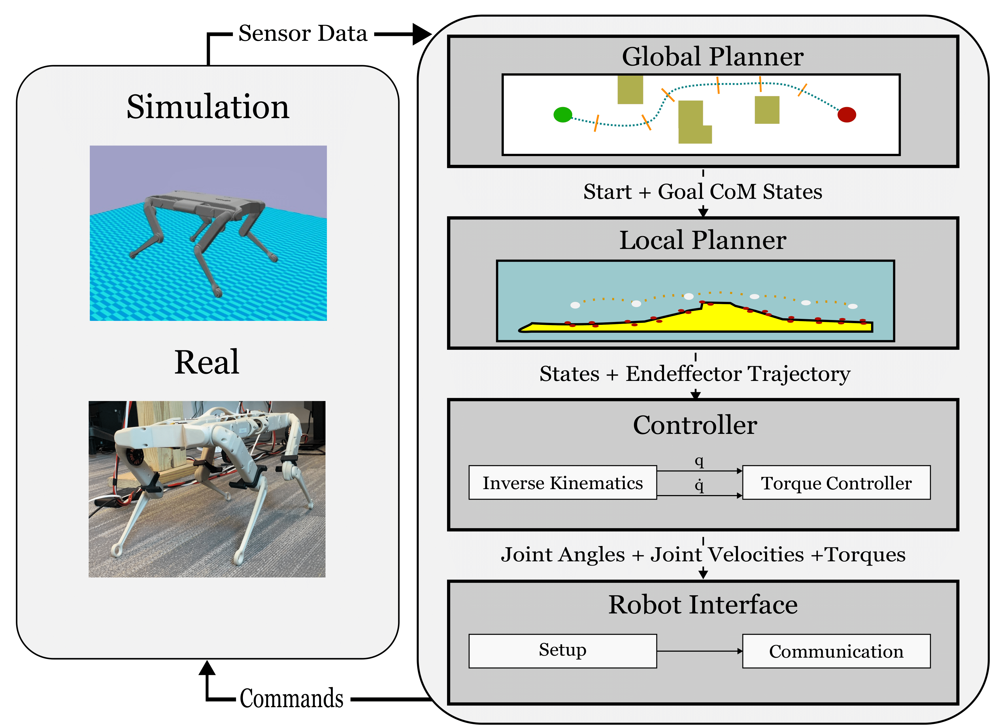

<link href='https://fonts.googleapis.com/css?family=Titillium+Web:400,600,400italic,600italic,300,300italic' rel='stylesheet' type='text/css'>
<head><meta http-equiv="Content-Type" content="text/html; charset=UTF-8">
  <title>Quadruped Trajectory Optimization Stack</title>

<!-- <meta property="og:image" content="images/teaser_fb.jpg"> -->
<meta property="og:title" content="TITLE">

<!-- Google tag (gtag.js) -->

<link media="all" href="./css/glab.css" type="text/css" rel="StyleSheet">

<meta content="MSHTML 6.00.2800.1400" name="GENERATOR">

</head>

<body data-gr-c-s-loaded="true">

<h1><strong>QTOS: An Open-Source Quadruped Trajectory Optimization Stack</strong></h1>

<h2>
    <a href="https://alexyskoutnev.github.io/alexyskoutnev-github.io/">Alexy Skountev 1</a>&nbsp;&nbsp;&nbsp;
    <a href="https://github.com/cinaral">Andrew Cinral1</a>&nbsp;&nbsp;&nbsp;
    <a href="https://praful22.github.io/">Praful Sigdel1</a>&nbsp;&nbsp;&nbsp;
    <a href="https://github.com/forrestlaine">Forrest Laine1</a>&nbsp;&nbsp;&nbsp;
  </h2>
  <h2>
    <a href="https://www.vanderbilt.edu/">1Vanderbilt University</a>
  </h2>
  <h2><a href="http://arxiv.org">Paper</a> | <a href="https://github.com/Alexyskoutnev/Quadruped-Trajectory-Optimization-Stack">Code</a></h2>
  

 

<video width="300" height="400" class="fullscreen-video" autoplay loop, controls>
  <source src="./assets/QTOS_DEMO_3.mp4" type="video/mp4">
</video>

  <table align=center width=800px>
                <tr>
                    <td>

We introduce a new open-source framework, Quadruped Trajectory Optimization Stack (</b>QTOS</b>), which integrates a global planner, local planner, simulator, controller, and robot interface into a single package. QTOS serves as a full-stack interface, simplifying continuous motion planning on an open-source quadruped platform by bridging the gap between middleware and gait planning. It empowers users to effortlessly translate high-level navigation objectives into low-level robot commands. Furthermore, QTOS enhances the stability and adaptability of long-distance gait planning across challenging terrain.

</td></tr></table>

  

<h1 align="center">Deployment</h1>
  <table align=center width=800px><tr><td> 
 We showcase a long-distance stitched gait plan generated by QTOS, demonstrating its capability to navigate a challenging environment. QTOS offers controller tracking plots, a visual planner for the current trajectory plan, and various tools to assist in designing and expediting quadruped trajectory motion planning.
  
</td></tr></table>

<h1 align="center">System Architecture</h1>
  <table border="0" cellspacing="10" cellpadding="0" align="center"> 
    <tbody>
      <tr> 
        <td align="center" valign="middle">
        
        </td>
      </tr>
    </tbody>
  </table>
  <table align=center width=800px>
                <tr>
                    <td>
  

  

</td></tr></table>

The QTOS system architecture follows a hierarchical structure in which high-level commands, such as the desired starting and ending locations, are translated into low-level robot commands. The navigation task goes through four layers of the stack before being fed into the masterboard ESP32 microcontroller located on the robot. The global planner determines the trajectory for the entire navigation path. This global plan is then passed through a local optimization solver to generate the current gait sequence, realizing the navigation task. Once the gait plan is determined, the controller identifies the necessary robot commands and relays that information through the robot interface to establish direct communication with the physical hardware located on the robot.

<h1 align="center">Navigation Demonstrations</h1>
  

    

        <video src="./assets/Walking_QTOS.mp4" width="100%" autoplay loop controls></video>
    

    

        <video src="./assets/AVOIDANCE_4x_.mp4" width="100%" autoplay loop controls></video>
    

    

        <video src="./assets/QTOS_CLIMBING_6.mp4" width="100%" autoplay loop controls></video>
    

  

  <table align=center width=800px><tr><td> 

  
</td></tr></table>
  We demonstrate three different navigation tasks that QTOS can generate for a quadruped system. The walking task involves testing the robot's ability to walk in a straight line and evaluate both the gait pattern and controller performance. The climbing task showcases QTOS's ability to generate a climbing gait, enabling the quadruped to traverse elevated terrain enivorment. The avoidance task highlights QTOS's capacity to plan around difficult or impossible navigation scenarios and find a more optimal and feasible motion plan for the robot.

<!-- <h1 align="center">Real-Hardware Demonstrations</h1>
  <table align=center width=800px><tr><td> 
 
  
</td></tr></table> -->

<h1>Citation</h1>

<table align=center width=800px>
  <tr>
    <td>
    <!-- <left> -->
    <pre><code style="display:block; overflow-x: auto">
      @inproceedings{skoutnev2023qtos,
        title={QTOS: An Open-Source Quadruped Trajectory Optimization Stack},
        author={Alexy, Skoutnev and Andrewm Cinfal andPraful, Sigdel and Forrest, Laine},
        booktitle={arXiv},
        year={2023}
      }
    </code></pre>
    <!-- </left> -->
    </td>
  </tr>
</table>